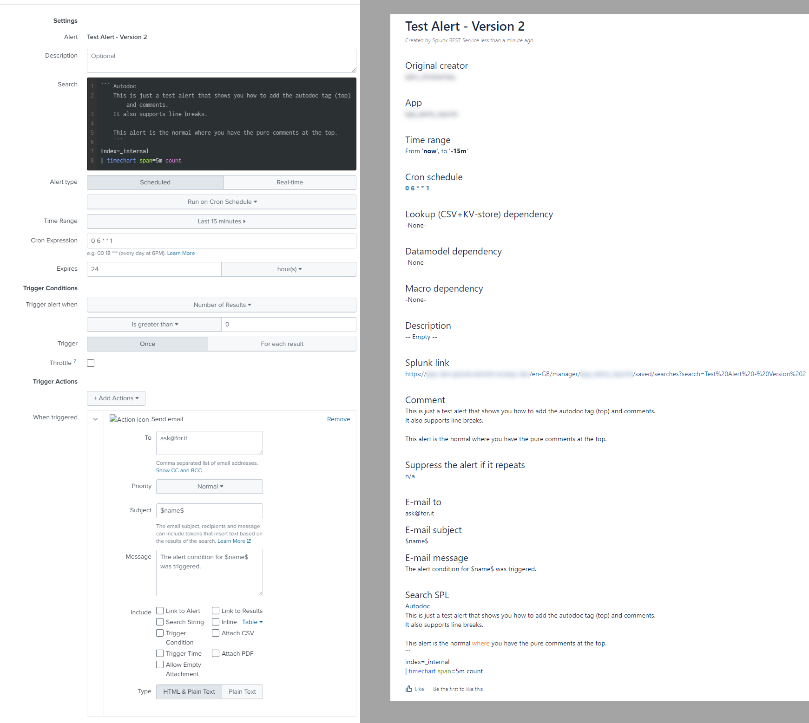

# Splunk Autodoc for Atlassian Confluence Wiki

## Autodoc: Create and Update.spl

Alert used to create and update Atlassian Confluence Wiki based installations

&dollar;result.title&dollar;

## Autodoc: Delete.spl

Alert used to delete Wiki pages when you remove alerts in Splunk or remove the Autodoc tag in the alert itself.

## Results

### Normal SPL

### Abnormal SPL

